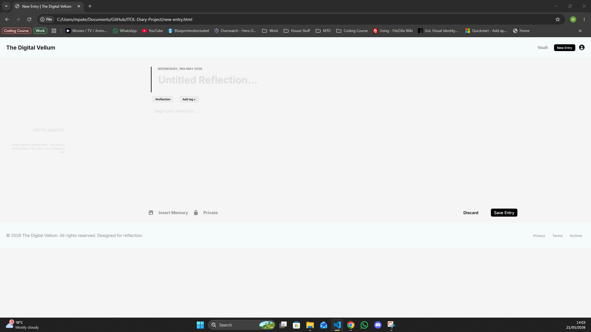
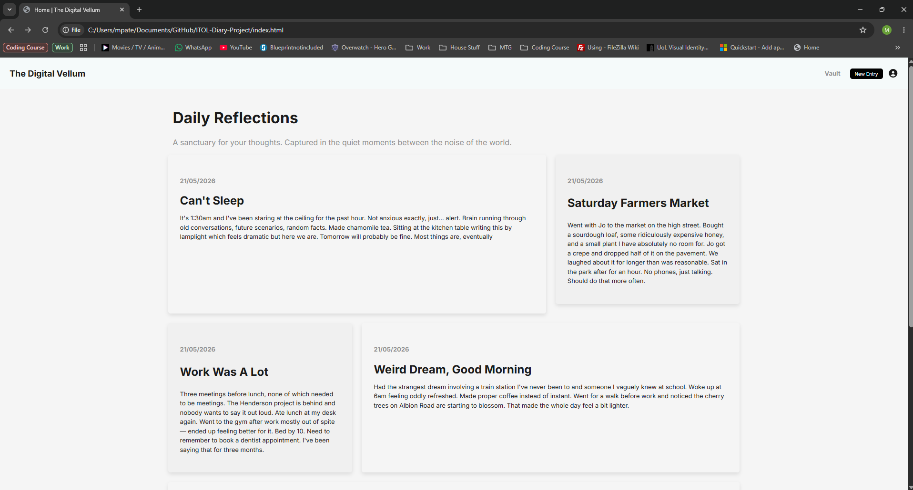
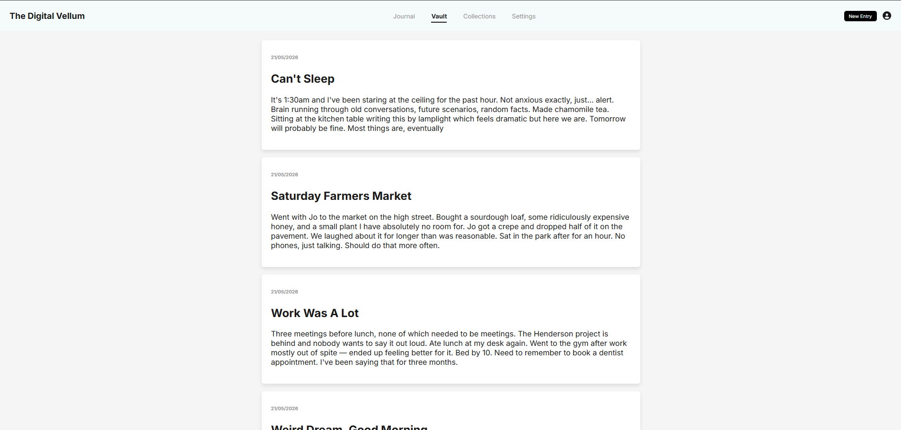

# ITOL-Diary-Project
This is my ITOL project for building a multi-page digital diary.

Link to relevant MDN documentation:
- localStorage: https://developer.mozilla.org/en-US/docs/Web/API/Window/localStorage
- JSONparse: https://developer.mozilla.org/en-US/docs/Web/JavaScript/Reference/Global_Objects/JSON/parse
- JSONstringify: https://developer.mozilla.org/en-US/docs/Web/JavaScript/Reference/Global_Objects/JSON/stringify
- .toLocaleDateString(): https://developer.mozilla.org/en-US/docs/Web/JavaScript/Reference/Global_Objects/Date/toLocaleDateString

Comments:
So i've finally completed the project with all parts tested and working. Getting as close to the wireframe as possible took the most time and enjoyed the JS as it was a challenge having to research localStorage and play with JSON.parse & JSON.stringify as havent encountered them before. To tackle the '5 most recent entries logic' i decided to use the unshift method instead of the push method to add the newest objects at the front of the array and not the back. This is so i didnt have to reverse the array before pushing the 'new-entry'. I think there is definitely one thing i could improve on, and that is selecting class/ID names for elemtnts for HTML & CSS. Could make the CSS more efficient and easily readable. However, i do like creating root variables within the CSS which enables ease of design changes throughout without having to change individual lines of code.

Posted live netlify: https://euphonious-vacherin-96ee25.netlify.app/

Images below;

Things i'd like to add:
- Working tab(pill) selector - Select what kind of entry and maybe subtly changing the colour of cards corresponding to tab selected
- Better displaying of date, formatting of toLocaleDateString()
- Finishing other pages ie. Privacy, terms, Archive, Profile
- Working 'insert memory' & 'Private' buttons on new-entry.html
- Correct footer location (Stuck to the bottom of the screen)
- Use of media querys to improve UI accesibility on different sized screens
